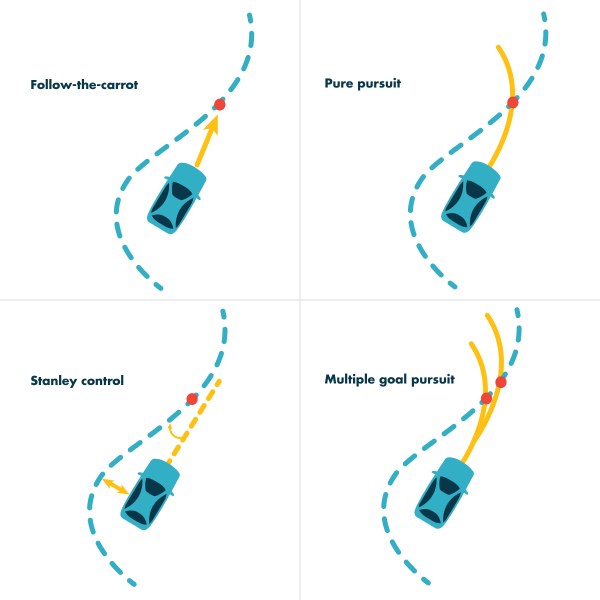
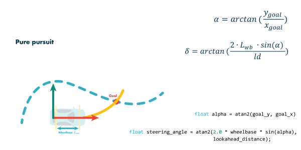
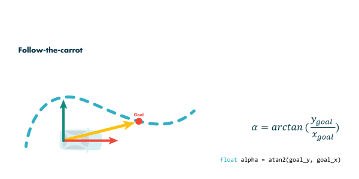
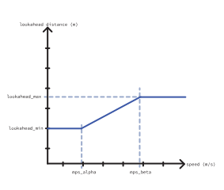
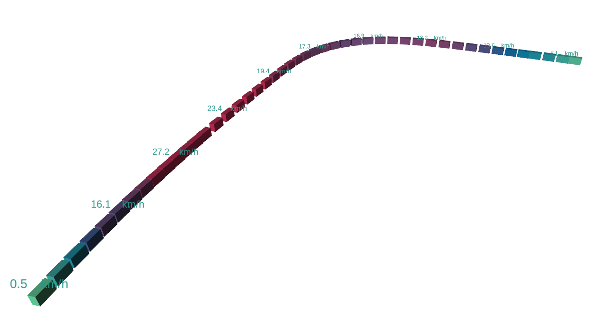

# `wayp_plan_tools` `ROS 2` package
Waypoint and planner tools for `ROS 2` with minimal dependencies.

Planner / control nodes:
- `single_goal_pursuit`: Pure pursuit (for vehicles / robots), a simple cross-track error method
- `multiple_goal_pursuit`: Multiple goal pursuit for vehicles / robots an implementation of our [paper](https://hjic.mk.uni-pannon.hu/index.php/hjic/article/view/914)
- `stanley_control`: Stanley controller, a heading error + cross-track error method
- `follow_the_carrot`: Follow-the-carrot, the simplest controller

Waypoint nodes:
- `waypoint_saver`: saves the waypoints to a csv
- `waypoint_loader`: loads the waypoints from a csv to a ROS 2 topic
- `waypoint_to_target`: translates the global waypoint array to local target waypoint(s), thus it makes possible to use the controller nodes in a standalone way


## Build

It is assumed that the workspace is `~/ros2_ws/`.

### `Terminal 1` 🔴 clone

```
cd ~/ros2_ws/src
git clone https://github.com/jkk-research/wayp_plan_tools
```

### `Terminal 1` 🔴 build
```
cd ~/ros2_ws
colcon build --packages-select wayp_plan_tools
```

### `Terminal 2` 🔵 run
```
source ~/ros2_ws/install/local_setup.bash && source ~/ros2_ws/install/setup.bash
ros2 launch wayp_plan_tools waypoint_saver.launch.py
```

# Control nodes
In this project the `single_goal_pursuit`, the `multiple_goal_pursuit`, `stanley_control` and the `follow_the_carrot` controllers are implemented. A high level overview about the algorithms is visible on the following figure:



# `single_goal_pursuit` node
The "classic" pure pursuit implementation


# `multiple_goal_pursuit` node 
Multiple goal pursuit for vehicles / robots, an implementation of our [paper](https://hjic.mk.uni-pannon.hu/index.php/hjic/article/view/914)

# `follow_the_carrot` node
Follow-the-carrot, the simplest controller


# `waypoint_to_target` node
Reads the waypoint array and speeds, from that it creates single or multiple goal points.

It also provides a `/metrics_wayp` array topic with the following  elements:

| Array element | Meaning | Const
| :--- | :--- | :---
|`[0]` | current lateral distance to the waypoint (signed, cross-track error) | `CUR_LAT_DIST_SIGNED`
|`[1]` | current lateral distance to the waypoint (absolute value) | `CUR_LAT_DIST_ABS`
|`[2]` | average lateral distance over time | `AVG_LAT_DISTANCE`
|`[3]` | maximum lateral distance over time | `MAX_LAT_DISTANCE`
|`[4]` | current waypoint ID | `CUR_WAYPOINT_ID`
|`[5]` | target waypoint ID | `TRG_WAYPOINT_ID`
|`[6]` | target waypoint longitudinal distance  | `TRG_WAY_LON_DIST`



# `waypoint_saver` node 
Saves the waypoints to a csv. Important parameters are `file_name` and `file_dir`. Set from terminal or from a [launch file](launch/waypoint_saver.launch.py)

``` py
ros2 run wayp_plan_tools waypoint_saver --ros-args -p file_name:=tmp1.csv -p file_dir:=/mnt/bag/waypoints
```

# `waypoint_loader` node
Loads the waypoints from a csv to a ROS 2 topic. Set from terminal or from a [launch file](launch/waypoint_loader.launch.py)

``` py
ros2 run wayp_plan_tools waypoint_loader --ros-args -p file_name:=tmp1.csv -p file_dir:=/mnt/bag/waypoints
```


# Usage with a simulator

Please refer to [github.com/jkk-research/sim_wayp_plan_tools](https://github.com/jkk-research/sim_wayp_plan_tools).


# Cite & paper

If you use any of this code please consider citing the [paper](https://hjic.mk.uni-pannon.hu/index.php/hjic/article/view/914):

```bibtex
@Article{horvath2020multigoalpursuit, 
    title={Theoretical background and application of multiple goal pursuit trajectory follower}, 
    volume={48}, 
    url={https://hjic.mk.uni-pannon.hu/index.php/hjic/article/view/914}, 
    DOI={10.33927/hjic-2020-03}, 
    number={1}, 
    journal={Hungarian Journal of Industry and Chemistry}, 
    author={Horváth, Ernő and Pozna, Claudiu and Kőrös, Péter and Hajdu, Csaba and Ballagi, Áron}, 
    year={2020}, 
    month={Jul.}, 
    pages={11–17} 
}
```

